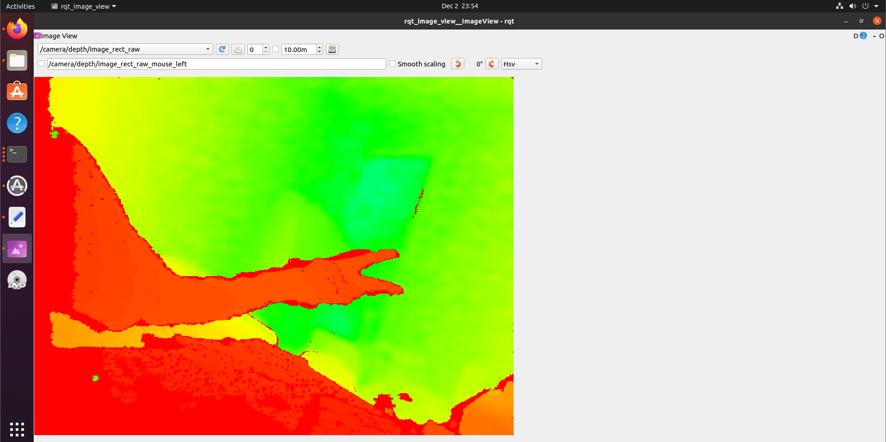

# FinalProjectTurtle
Turtlebot final Project :)


## RealSense Setup
1. Installed on Ubuntu 20.04 LTS.
2. Remember to run
	```
		sudo cp config/99-realsense-libusb.rules /etc/udev/rules.d/
	
		sudo udevadm control --reload-rules&&udevadm trigger
	``` after install the dependencies.
2. Plug the camera when building librealsense2 SDK.
3. Run `realsense-viewer` to test if successfullt installed.

### Reference
1. Instruction: https://github.com/IntelRealSense/librealsense/blob/master/doc/installation.md
2. Debug video: https://www.bilibili.com/video/BV1iM4y1d7kL?spm_id_from=333.788.videopod.sections&vd_source=4da953d6172fefe3b5aabce7be3f5662


## ROS Setup
### Installation before dependencies
Follow the instruction here: https://wiki.ros.org/noetic/Installation/Ubuntu

### Installation of dependencies
1. Essential packages
```
sudo apt-get install ros-noetic-joy ros-noetic-teleop-twist-joy \
ros-noetic-teleop-twist-keyboard ros-noetic-laser-proc \
ros-noetic-rgbd-launch ros-noetic-rosserial-arduino \
ros-noetic-rosserial-python ros-noetic-rosserial-client \
ros-noetic-rosserial-msgs ros-noetic-amcl ros-noetic-map-server \
ros-noetic-move-base ros-noetic-urdf ros-noetic-xacro \
ros-noetic-compressed-image-transport ros-noetic-rqt* ros-noetic-rviz \
ros-noetic-gmapping ros-noetic-navigation ros-noetic-interactive-markers
```
2. Turtle bot packages
```
$ sudo apt install ros-noetic-dynamixel-sdk
$ sudo apt install ros-noetic-turtlebot3-msgs
$ sudo apt install ros-noetic-turtlebot3
```
3. RealSense Package for ROS1
	1. Follow the instrustion here: https://github.com/IntelRealSense/realsense-ros/tree/ros1-legacy?tab=readme-ov-file
	2. Fail to catkin_make: https://blog.csdn.net/tanmx219/article/details/122765853

## Test RealSense Using ROS:
* Run `roslaunch realsense2_camera rs_camera.launch` to open the camera. Then run `rosrun rviz rviz`
* See ros topic by install `ros-noetic-rqt-image-view` and run `rqt_image_view`

* See point cloud by install `ros-noetic-rviz` and run `roslaunch realsense2_camera demo_pointcloud.launch `


## Build a map
Reference: https://github.com/IntelRealSense/realsense-ros/wiki/SLAM-with-D435i
1. Install `imu_filter_madgwick`: https://github.com/CCNYRoboticsLab/imu_tools
2. Install `rtabmap_ros`: https://github.com/introlab/rtabmap_ros
3. Save ros bag and map
	* Ros bag: `rosbag record -O my_bagfile_1.bag /camera/aligned_depth_to_color/camera_info  camera/aligned_depth_to_color/image_raw /camera/color/camera_info /camera/color/image_raw /camera/imu /camera/imu_info /tf_static`
	* Point cloud: `rosrun pcl_ros pointcloud_to_pcd input:=/rtabmap/cloud_map`
	* Run `pcl-viewer 1733251529469913.pcd`
	
	
	
## Compare two images
1. Install dependencies: `pip install opencv-python opencv-contrib-python pyrealsense2 numpy matplotlib`
2. Process: Match features using ORB	
	* Input: Video Feed
	* Output: 3D coordinates of matched feature point


## TODO
1. Use the 3D points to localize the scout TurtleBot in the environment. 
2. Compute the centroid of the matched 3D points as the approximate position of the scout TurtleBot.
3. Set up the ROS navigation stack (move_base) with the computed 3D position as the goal. 
4. Convert the 3D position to the robot's frame of reference or map frame if you're using SLAM.
5. [Optional] Use an object detection model (e.g., YOLO or MobileNet-SSD) to detect the scout TurtleBot visually.

## Workflow
1. Use RealSense D435i to simutaneously capture RGB images and point cloud data.
	* Extract ORB features from RGB images
	* Use the point cloud data for 3D spatial mapping and object localization
2. Match the last captured image from the scout TurtleBot before the camera failure with real-time images captuired by second bot.
3. Localize features in 3D space.
	* Map the matched ORB features to their corresponding 3D coordinates by realsense packages.
	* Use the depth information from the D435i to associate 2D features with 3D points.
4. Navigate to the scout turtlebot
	* Plan and execute a navigation path for the secondary turtlebot
5. Verify the scout turtlebot.
	* Confirm the presence of scout turtlebot using WIFI or keypoint matching.
